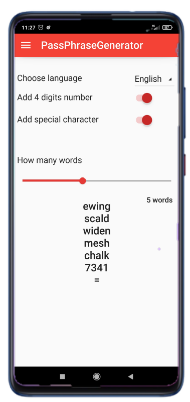
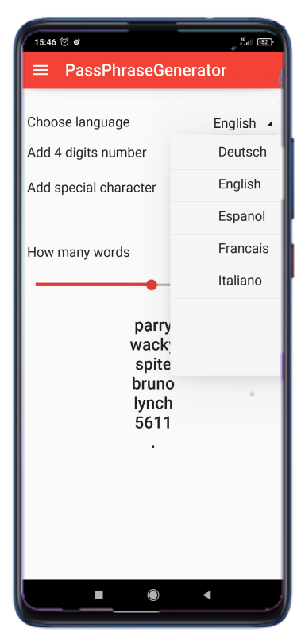
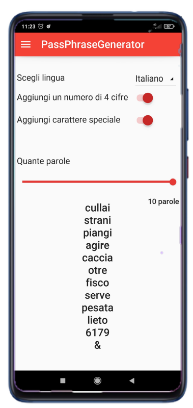

# PassPhraseGenerator
  

The code of the example app, written using Kivy an KivyMD, that you can see in action at [not yet available link]()
It' s a Passphrase generator based on Diceware. I have built it to run on Android but I also use it on my Linux desktop.
I' m a hobbist, this is just an exercise, but you can use this app whenever you are requested to create or modify a password or a passphrase long enough and easy for you to remember.
Click [here](https://theworld.com/~reinhold/diceware.html) for info about Diceware and  words lists.
I hope to be helpful by sharing this code.
